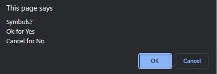

# Module-3-Challenge

## Description

This password generator is for anyone looking to generate a password with criteria as well as a certain length. I built this project to solver anyone issues with needing a strong secure password. I learned how to implemnt if statements, for loops, objects, alert/confirm/prompt, add event listener.

## Installation

Run the URL of the [Password Generator](https://hankrichter.github.io/Password-Generator/)

## Usage

Provide instructions and examples for use. Include screenshots as needed.

To add a screenshot, create an `assets/images` folder in your repository and upload your screenshot to it. Then, using the relative file path, add it to your README using the following syntax:

Shows the application deployed

Asks for the desired password length

Rejects password if it is not within 8-128 characters

Lowercase confirm

Uppercase confirm

Numbers confirm

Symbols confim

Alerts if no criteria is selected

Successful password generated
